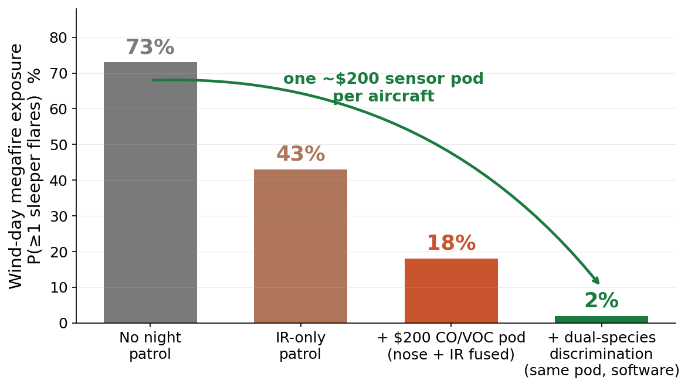
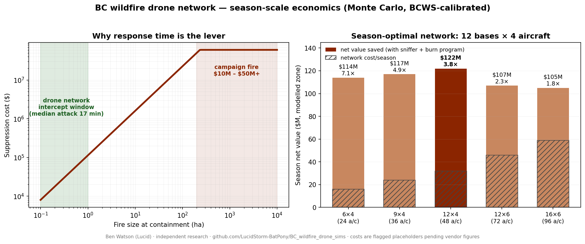

# BC Wildfire Drone Network — Season-Scale Simulations

Monte Carlo simulations of the economics and tactics of a heavy-lift firefighting
drone network in British Columbia, modelled on the published performance of the
ACC Innovation Thunder Wasp class of aircraft (350–400 kg payload, autonomous
water pickup, night and smoke capable) and calibrated against BC Wildfire Service
outcomes.

**Author:** Ben Watson ("Lucid") — Independent Researcher, Salmon Arm, BC
**Contact:** ben.watson.research@proton.me
**Date:** August 2026

This is unaffiliated work: no vendor, agency, or investor relationship. The code
is published so that every number in the accompanying briefs can be checked
rather than believed — and re-run against your own cost figures and fire-history
data. If you work in wildfire operations, prescribed fire, or drone fire
programs and want the models calibrated to your data, get in touch.


*A ~$200 CO/VOC sensor pod on night patrol cuts simulated wind-day megafire exposure from 73% to 2% — the highest value density of any component in the system (`sniffer_patrol_sim.py`).*

## Headline findings

- Bulk water is the wrong axis: drones lose to conventional aviation on $/litre
  and win on **response time** (suppression cost is violently convex in fire
  size) and on flying at **night and in smoke**, when crewed aviation is
  grounded or degraded.
- Season-optimal network on the modelled zone: **12 bases × 4 aircraft**
  (~48 airframes), returning roughly **4× its ~$29M/season cost**. Squad depth
  beyond 4 looks good fire-by-fire but almost never binds at season scale.
- A deliberate-overkill dispatch doctrine ("double-tap" + earliest-deadline-
  first) cuts escalations ~60% and halves total drops. 24 aircraft hold a
  replay of the July 2026 lightning siege; 72 are unbreakable at 4× the worst
  BCWS warning level.
- The highest-value component in the system costs about **$200**: a CO +
  wood-VOC gas-sensing pod for night patrol, cueing IR to find smoldering
  holdover fires before they flare on wind days (the Bush Creek East
  mechanism). Simulated wind-day megafire exposure drops from >70% to low
  single digits.
- The same aircraft holding **prescribed-burn perimeters** roughly double the
  number of eligible burn days and could secure ~17,000 ha of prescribed and
  cultural fire per season on one zone — several times the current provincial
  program — converting basing from a cost line into standing infrastructure.
- Doctrine target: **zero unchosen fire**, not zero fire.


*Left: suppression cost convexity — the network's case is intercepting fires in the green window. Right: season net value by configuration from `unified_season_sim.py`; hatched region is network cost. Figures generated by make_figure.pyandmake_sniffer_figure.py (requires matplotlib).*

## Repository contents

| File | What it models |
|---|---|
| `staging_simulation.py` | Dispatch/staging economics: base count × squad depth sweep, escape rates, coverage-gap decomposition (night/smoke/remote), ROI by configuration. |
| `pincer_containment_sim.py` | Anchor-and-flank containment of established fires; day-only vs 24/7 head-ROS ceilings; squad-size quanta. |
| `siege_capacity_sim.py` | Lightning-siege queueing: kill-cliff (drops-to-extinguish vs fire age), double-tap + EDF doctrine, network breaking points. |
| `holdover_patrol_sim.py` | Sleeper-fire seeding by lightning barrages; wind-day flare exposure with and without night IR patrol. |
| `sniffer_patrol_sim.py` | Night plume physics (stable boundary layer, drainage channeling), gas-sensor detection ranges, fused nose+IR patrol performance, dual-species threshold sensitivity. |
| `burnbox_sim.py` | Prescribed-burn perimeter holding: slop-over vs wind, safe-wind ceiling vs holding force, burnable-days multiplier. |
| `unified_season_sim.py` | Full April–October season composing all layers; configuration × sensor × burn-program sweep; season-optimal network. |

Each script is standalone and prints its results. The two four-page technical
briefs (staging economics; siege capacity and holdover doctrine) and a two-page
summary are available on request.

## Running

Requires Python 3 and NumPy only.

```bash
pip install numpy
python staging_simulation.py
```

Runtimes range from seconds to a few minutes (the unified season sim is the
slowest). Each script sets its own RNG seed for reproducibility.

## Calibration and honesty notes

- Calibrated against public BC Wildfire Service figures: ~1,400 fires and 85%
  held under 4 ha in recent seasons; provincial suppression costs $0.5–1B+;
  the July 2026 lightning siege (~100 starts/24 h observed, warnings up to
  150/day); ~15% of lightning fires holding over as multi-day smolders
  (published fire-science literature).
- The 2026 competitive baseline **includes** BCWS's expanding night-vision
  helicopter program. The network's residual edge concentrates in heavy smoke
  (where night-vision goggles cannot safely fly) and distributed response
  time. Earlier versions of this work overstated the night gap; the current
  numbers model against the improved baseline.
- Load-bearing assumptions are flagged in-code and in the briefs, notably:
  aircraft capital/ops costs (placeholders pending real vendor figures) and
  the prescribed-fire treatment valuation ($2,500/ha).
- These are strategic-scale models built to find structure (where value
  concentrates, what doctrine wins, where returns diminish) — not operational
  fire-behaviour prediction. Fire spread uses calibrated statistical
  distributions, not physical fire modelling.

## License

MIT — use it, check it, break it, improve it. Attribution appreciated.
